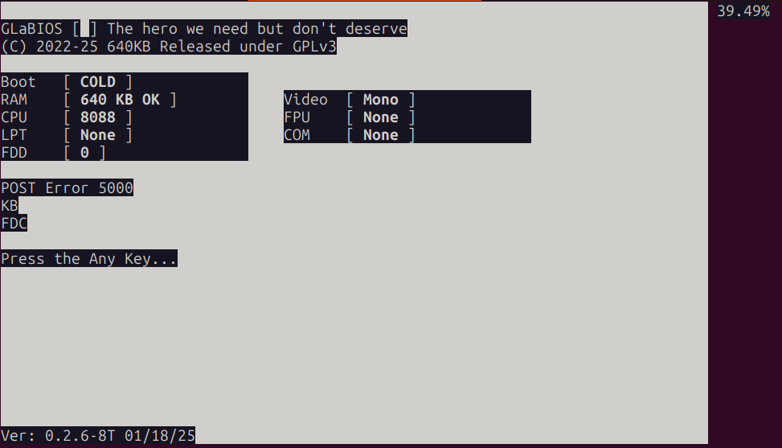

PyPC is an IBM PC (8088) emulator written in Python.

It is currently not even alpha. It boots, but only partially MDA and no keyboard support yet: you can see it starting e.g. GlaBIOS.
You need to have 'GLABIOS.ROM' in the directory from which you start 'main.py'. It requires python 3.something.

Note that this is a manual translation of https://github.com/folkertvanheusden/Dotxt

If you want a quicker version, run it from 'pypy'. For that you may need to invoke this first on the source code of PyPC:

    sed -i 's/import override,/import /g' *py
    sed -i 's/@override//g' *py

Folkert van Heusden

released under MIT license
